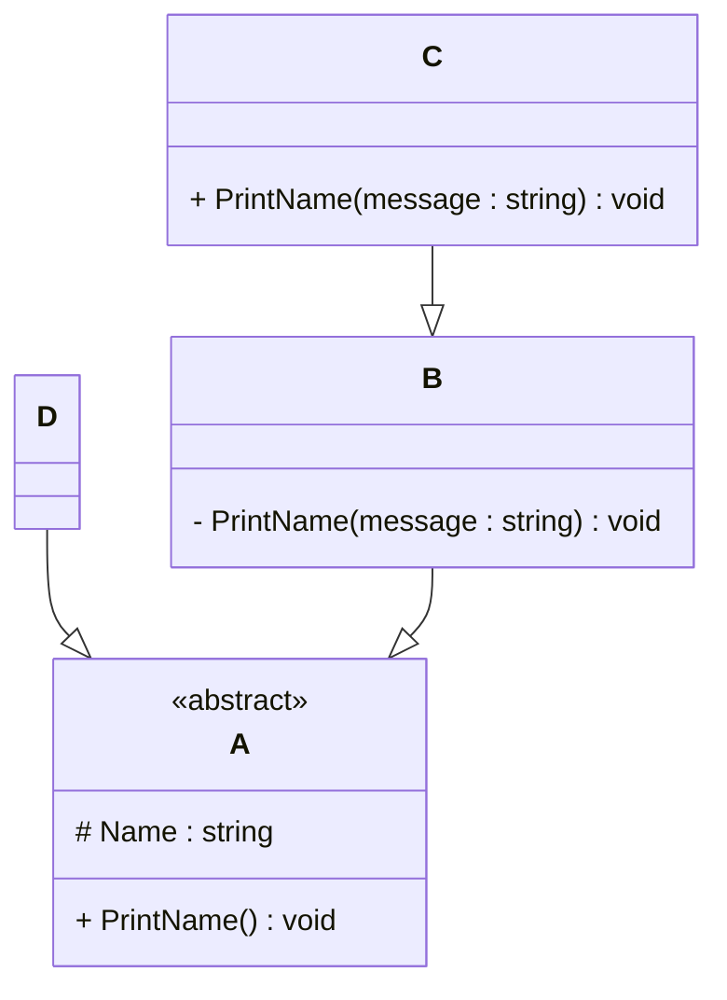

# Programming Test

This test was composed to create a general overview of your knowledge regarding general programming and how it fits with the needs in our lab. Please try to answer all questions using your own knowledge and in your own words. If you get stuck on one of the exercises, still try to give a short answer.

---

## Exercise 1

### Task
Write a program in the language of your choice where:

1. The iteration number (starting from 1), followed by a random number between 1 and 100, is printed 100 times.
2. After every 5 iterations, write an additional separator (e.g., `---`).
3. Write “Lucky number!” after every random number that is divisible by 7.

> Try to keep the procedure as short as possible.

import random

for i in range(1, 101):
    num = random.randint(1, 100)
    print(f"{i}: {num}", "Lucky number!" if num % 7 == 0 else "")
    if i % 5 == 0:
        print("---")
---
Explannation :
range(1, 101) ensures iteration starts from 1 and goes to 100.
random.randint(1, 100) generates a random number between 1 and 100.
A ternary expression prints "Lucky number!" only if the number is divisible by 7.
After every 5 iterations, --- is printed as a separator.

## Exercise 2

### 1. **What is your understanding of the term “Design Patterns”?**  
   Provide a description in your own words.

   Design Patterns are time-tested solutions to common software design issues. They provide reusable templates to help developers structure their code in a way 
   that is clear, maintainable, and scalable. Rather than recreating the wheel, programmers can use these basic methods to solve specific challenges in a variety 
   of programming environments.
   

### 2. **Explain the MVC Pattern**  
   - What does MVC stand for?
     Model view controller (MVC) is a design pattern that separates data, display and user interaction in software applications.
   - Explain the pattern in detail.
     Model :
    The Model handles the application's data and business logic. It specifies how data is organized, retrieved, and processed. It knows nothing about the user 
     interface.
    View :
    The View is responsible for presenting data to users. It listens for changes to the Model and adjusts the user interface accordingly. Views are often what 
     users see (for example, HTML pages )
    Controller :
    The controller serves as a middleman between the model and the view. it takes user input, modifies the model based on it, and then decides which view shpould 
     be presented.It coordinates the flow of data.
   - What are some use cases for this framework?
     Web apps – Clean separation of frontend and backend (eg., Djang).
    Mobile apps – Organize UI and logic (eg., iOS apps).
    Desktop apps – Modular GUI development (eg., Java Swing).
    Game development – Separate game logic, UI, and input handling.
    Enterprise tools – Maintainable structure for complex systems.

### 3. **List three other design patterns**  
   - Provide names and details for three additional design patterns.
     Singleton Pattern - Ensures only one instance of a class exists.
     Observer Pattern -  One object notifies multiple dependent objects on state changes.
     Factory Method Pattern - Creates objects without specifying the exact class of object that will be created.
   - Explain how you have used those patterns in the past and how they have solved your problem
     Singleton Pattern :
     Use Case: Centralized Logging System.
     How I Used It:
     In a backend web application, I required a global logger that all modules could access without having to create several instances (which could result in 
     inconsistent logging behavior).
     I implemented the logger as a singleton, so there was only one instance across the project.

     Problem Solved:
     Avoided duplicate log files.
     Memory utilization was reduced.
     Ensured consistent logging across all modules.
   
     Observer Pattern :
     Use Case: Real-Time Notification System.
     How I Used It:
     In a stock market dashboard, customers subscribed to specific stock updates. I used the Observer pattern, with each stock acting as a Subject and each user's 
     dashboard as an Observer.
     When a stock price changed, all relevant observers were automatically notified.

     Problem Solved:
     The data source was decoupled from the user interface.
     Real-time updates have been enabled without the need for polling.
     Allows for easy insertion and removal of user observers.

     Factory Method Pattern :
     Use Case: Game Object Creation
     How I Used It:
     In a 2D game, different stages required different sorts of adversaries (such as EasyEnemy and BossEnemy ). Rather than hardcoding object creation, I used the 
     Factory Method to dynamically generate adversaries based on level type.

     Problem Solved:
     Made the codebase scalable.
     Streamlined object creation logic.
     Allows for easy addition of new opponent kinds without having to change existing code.
   - Use diagrams to explain the design patterns.
     1. Singleton Pattern
     ```mermaid
    classDiagram
    class Singleton {
        - instance: Singleton
        + getInstance(): Singleton
        + operation()
    }

    Singleton : +getInstance()
    Singleton : -instance

2. Observer Pattern
   ```mermaid
   graph LR
    A[Subject] -->|Notifies| B[Observer]
    B --> C[ConcreteObserver1]
    B --> D[ConcreteObserver2]
    A --> B
    C -->|State Update| A
    D -->|State Update| A

3. Factory Method Pattern
   ```mermaid
   classDiagram
    class Creator {
        +createProduct() 
    }

   class ConcreteCreator {
        +createProduct()
    }

   class Product {
        <<interface>>
    }
    
---
Singleton Pattern:
The diagram shows the structure of a Singleton class, which has a private static instance (instance) and provides a global point of access via the getInstance() method.
Observer Pattern:
The above figure shows how the Subject notifies the Observer, which then communicates with the concrete observers (ConcreteObserver1 and ConcreteObserver2) when the state changes.
Factory Method Pattern:
The Creator class has a factory method (createProduct()) to create different products. The ConcreteCreator class implements this method and instantiates specific Product classes. ConcreteProduct is one such implementation.

## Exercise 3

### 1. **Implementation Task**  
   Based on the class diagram below, provide an implementation in any object-oriented programming language of your choice.
   

A is an abstract class with a protected Name attribute and a public PrintName() method.
B extends A and has a private PrintName(message) method.
C extends B and has a public PrintName(message) method.
D extends A.

    # Abstract class A
     class A(ABC):
    def __init__(self, name: str):
        self._Name = name  # Protected attribute

    @abstractmethod
    def PrintName(self):
        pass

    # Class B inherits from A
    class B(A):
    def __init__(self, name: str):
        super().__init__(name)

    # Private method
    def __PrintName(self, message: str):
        print(f"B: {message} - {self._Name}")

    # Class C inherits from B
    class C(B):
    def __init__(self, name: str):
        super().__init__(name)

    # Public method with same signature
    def PrintName(self, message: str):
        print(f"C: {message} - {self._Name}")

    # Class D inherits from A
    class D(A):
    def __init__(self, name: str):
        super().__init__(name)

    def PrintName(self):
        print(f"D: {self._Name}")

### 2. **Key Questions**  
   - Are you able to directly create a new instance of `ObjectA`? Please explain your answer.
    It depends on how ObjectA is defined. Consider these possibilities:
    If ObjectA is an abstract class or an interface, you cannot instantiate it directly.
    If ObjectA is a concrete class (i.e., not abstract and has a public constructor), you can create an instance using new ObjectA().
    If the constructor of ObjectA is marked private or protected, you might not be able to instantiate it outside its scope. 
    For example,
    public abstract class ObjectA { }  // Cannot instantiate directly
    public class ObjectA { }           // Can instantiate with new ObjectA()
--- 
   - Given an instance of `ObjectC`, are you able to call the method `PrintMessage` defined in `ObjectB`? Please explain your answer.
     It depends on the inheritance or composition relationship between ObjectC and ObjectB.
     If ObjectC inherits from ObjectB, and PrintMessage is public or protected, then yes, you can call PrintMessage on ObjectC.
     If ObjectC contains ObjectB as a member (composition), you must access the member: objectC.B.PrintMessage().
     If there's no relationship, you cannot call the method directly.
     For example,
     public class ObjectB {
     public void PrintMessage() => Console.WriteLine("Hello");
}

public class ObjectC : ObjectB { }  // Inheritance

ObjectC c = new ObjectC();
c.PrintMessage();  // Valid

   - Try to explain as many key features of object-oriented programming as you can find in this example.

   Encapsulation: Bundling data (fields) and behavior (methods) inside classes.
   Inheritance: If ObjectC inherits from ObjectB or ObjectB from ObjectA, this is classical inheritance.
   Polymorphism: If methods like PrintMessage are overridden using virtual/override or interface implementations.
   Abstraction: If ObjectA is an abstract class or interface, it's an example of hiding implementation details and defining a contract.
   Composition: If ObjectC includes instances of ObjectB or ObjectA rather than inheriting them.
   Access Modifiers: Control access to members, supporting encapsulation (e.g., public, private, protected).


## Exercise 4

### Maintaining and Expanding Software for Component Validation

This exercise focuses on strategies for working with existing code bases and ensuring the software remains maintainable as new features and requirements are introduced.

### 1. **Working with Existing Code**  
- How would you approach understanding and contributing to an existing code base with minimal disruption?
  
  Take some time to read through any documentation and get a feel for how things are put together. Look at the key components and how they connect.
  
- What practices would you follow to ensure your changes integrate well with the current structure?

  Stick to the existing coding style, keep your changes small, and make sure to test thoroughly. This ensures your updates don't cause headaches for anyone else.

### 2. **Ensuring Maintainability**  
- What techniques would you use to keep the code base clean, modular, and easy to maintain as new features are added?

  Break the code into smaller, easy-to-understand pieces. Refactor when things start getting messy.
  
- How would you handle code documentation and testing to support long-term maintainability?

  Write clear, helpful comments and keep them updated. Write tests to make sure new features don't break things, and use automated tools to check everything works 
  smoothly.

### 3. **Balancing Flexibility and Stability**  
- How would you design or refactor the software to make it flexible for future changes while ensuring the existing functionality remains stable?

  Make your code flexible so it’s easy to add new features in the future without breaking what already works.
  
- Which design patterns or principles would you apply to achieve this balance

  Use simple design patterns like Factory or Strategy to make sure the code is adaptable without overcomplicating things.
---
